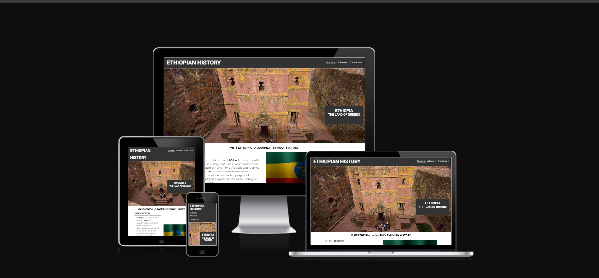
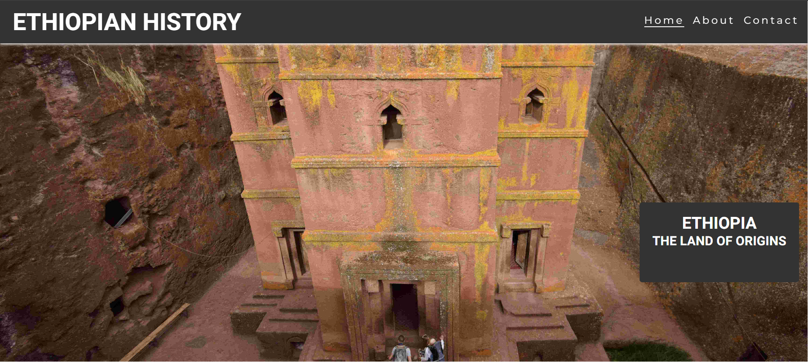
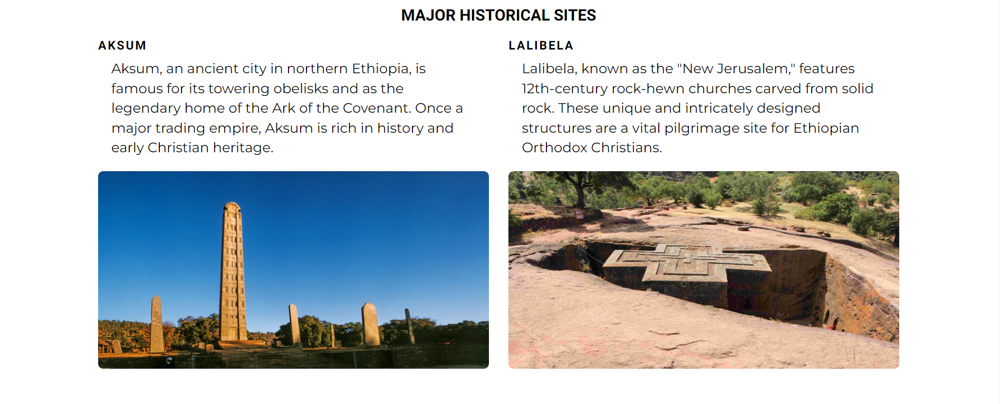
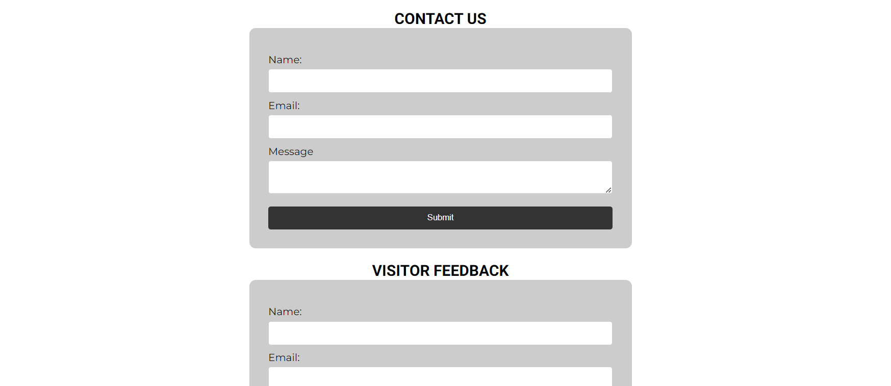
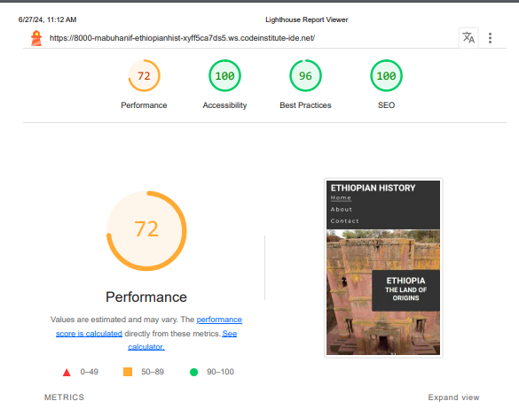
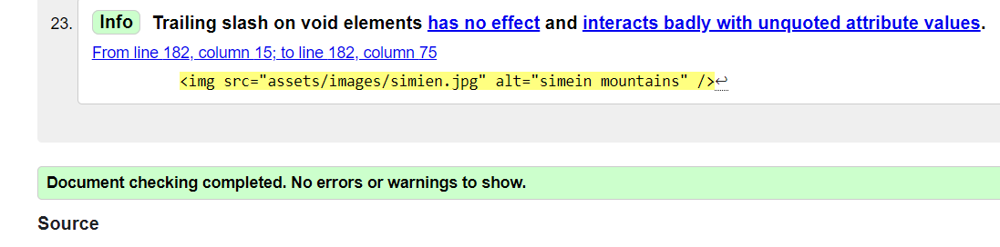
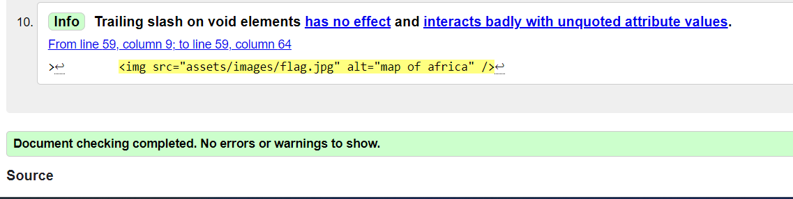
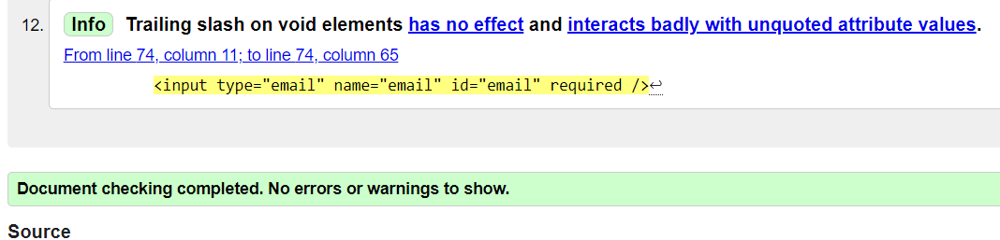
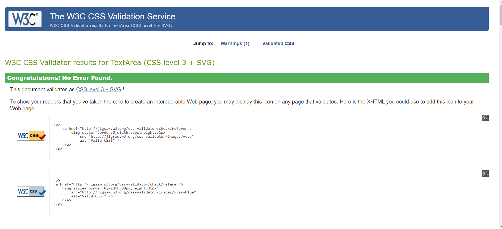

# Ethiopian History

Welcome to the Ethiopian History website, a dedicated platform for exploring the rich and diverse heritage of Ethiopia. This website provides in-depth information about Ethiopia's ancient civilizations, significant historical landmarks, and vibrant culture.

## Features

- **Navigation Bar**

  - Featured on all three pages, the full responsive navigation bar includes links to Home page, About and Contact page and is identical in each page to allow for easy navigation.
  - This section will allow the user to easily navigate from page to page across all devices without having to revert back to the previous page via the ‘back’ button.

- **The landing page image**

  - The landing includes a photograph >Lalibella with text overlay to give information about Ethiopia. 

- **Historical Sites Section**

  - The Historical Sites section will allow the user to know about visitable sites and choose sites to visit. 

- **Contact section**

  - This section will allow the user to reach out using the contact form for inquiries and feedback.
  - The website includes several interactive forms:
     - > **Contact Form:** For inquiries and feedback.
     - > **Visitor Feedback Form:** To gather feedback from visitors.

- **The Footer**

  - The footer section includes links to the relevant social media sites for the website. The links will open to a new tab to allow easy navigation for the user.
  - The footer is valuable to the user as it encourages them to keep connected via social media

## Technologies Used

### Html
> Used to structure my webpages and the bones of any web project

### CSS
> Used to style and add layout to my project.

### Font Awesome
> Used for all the icons in this project

### GoogleFonts
> Used for all the fonts used in this project and to compare potential fonts.

## Testing
> Testing on this project was mainly done manually by myself and a few friends to determine site usability, responsiveness and ensure it is intuitive to a completely new user.
## Google Lighthouse Testing

## HTML Validation

### index.html

#### Result: No Errors

### about.html

#### Result: No Errors

### contactUs.html

#### Result: No Errors 

## CSS Validation

### contact-complete.html

#### Result: No Errors

## **Bugs**
> Issues with centering content on the hero overlay. **fixed**

> Decided to improve the flow of the page that the parralax would be better between the two content sections. **fixed**

> Original image just didnt fit the flow of the page nor the style of the page **fixed**

> Font awesome social media icons showing as squares even though the script link is in the head and icon tags are correct. **fixed**

> Issue with footer content overlapping and not centering. **fixed**

## Deployment

> To deploy the project I followed these steps starting from the main project repository [here](https://mabuhanif.github.io/ethiopian-history/).

 1. Clicked on `Settings` on the navigation menu in the repository
 2. I then selected the `Pages` menu on the side bar.
 3. In the first dropdown menu labeled `Source` I selected the branch of the name `main` from the dropdown.
 4. In the next dropdown labeled `/root` I left as the default option.
 5. Selected Save
 
> I then received a notification from GitHub that my project is being deployed and after about 1 minute & a couple of refreshes of the page it was ready and live.

The live link can be found here - https://mabuhanif.github.io/ethiopian-history/

## Credits

### All images sourced from pexels.com. Links for images included below

> hero: Photo by Estella (https://www.pexels.com/photo/family-visiting-one-of-the-rock-hewn-churches-in-lalibela-7438884/)

> parralax: Photo by Abdulla Aljeberti from Pexels(https://www.pexels.com/photo/people-in-black-motorcycle-on-road-14391906/)

> Flag with stick: Photo by Kelly from Pexels(https://www.pexels.com/photo/national-colorful-flag-of-ethiopia-under-cloudy-sky-3794753/)

## Content & Resources

### Pexels.com
> Images used in this project.

### w3 schools
> Used for general lookup for HTML and CSS synthax queries

### Stack Overflow
> Used to query issues relating to overlapping CSS issues

### freefrontend.com(https://freefrontend.com/css-cards/)
> Used for inspiration & reference for the cards deck used in testimonials

### csstricks.com
> Used for help with flex box and allignment

### Code Institute
> Project created in line with course content and within project 1 scope.

## Acknowledgements

### Alan Bushell
> My mentor who provided me with constructive feedback and positive reinforcement where applicable.